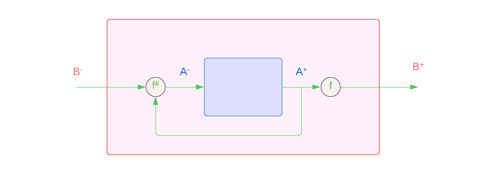
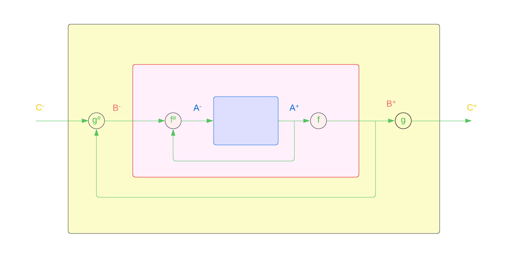
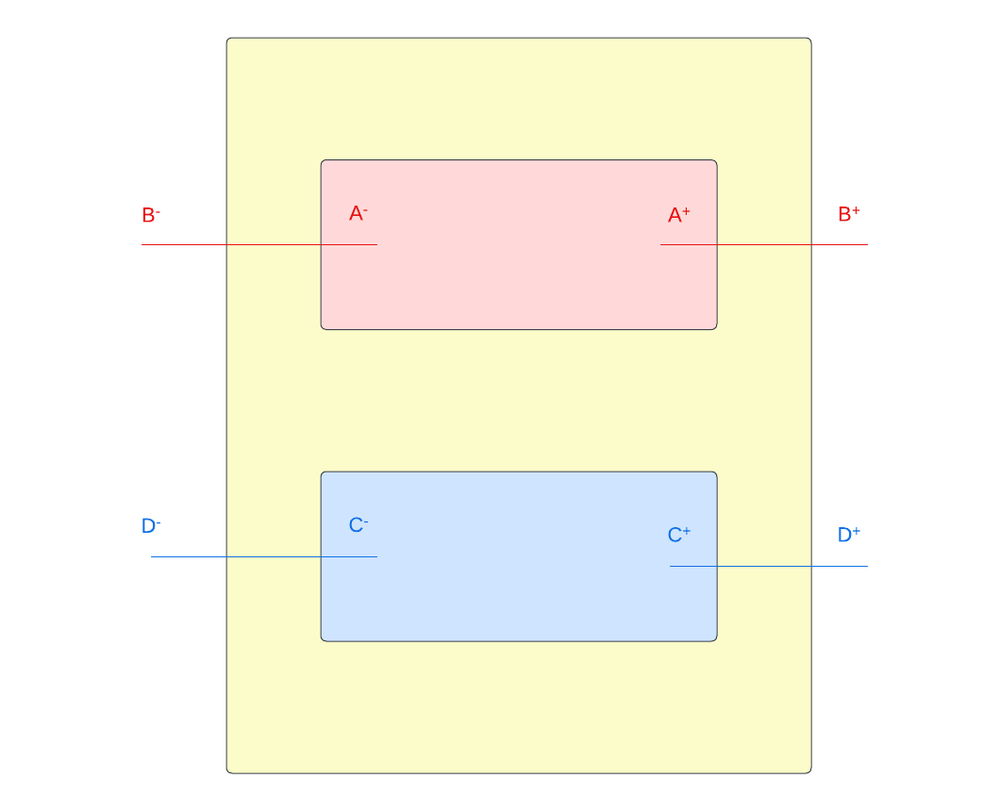

# Lenses

## Overview

A $\;Lens\;$ can be defined by the sets $A^{+}$, $A^{-}$, $B^{+}$ and $B^{-}$ in the relation
$$ {\binom{f^{\#}}{f}} : \binom{A^{-}}{A^{+}} \rightleftarrows \binom{B^{-}}{B^{+}} $$
alongside the relations
$$ f : A^{+} \rightarrow B^{+} $$
$$f^{\#} : A^{+} \times B^{-} \rightarrow A^{-} $$

We can think of $f$ as a $get$ operator and of $f^{\#}$ as a $put$ operator. In essence, what lenses can do is allow the interaction between two different interfaces.

* $f$ passes an object from the inner interface to the outer interface
* $f^{\#}$ changes the inner interface through the outer interface accounting for its current state




```hs title="Lenses in Haskell"
-- s represents the source entity (tuple in this example)
-- a represents the restricted view of the entity we are interested in
-- since haskell is strongly typed, it makes little sense to return a different
-- type, at least for data structures. This is why we only have
-- a single formal parameter for each pair

data Lens b a = Lens {
    get :: b -> a
,   put :: b -> a -> b
}
```

## Lens composition

Now that we know what a lens is, let's see how might we compose them

$$ {\binom{f^{\#}}{f}} : \binom{A^{-}}{A^{+}} \rightleftarrows \binom{B^{-}}{B^{+}} \quad \circ \quad  \binom{B^{-}}{B^{+}} \rightleftarrows \binom{C^{-}}{C^{+}} : {\binom{g^{\#}}{g}}$$

We want to obtain the following lens

$$ {\binom{h^{\#}}{h}} : \binom{A^{-}}{A^{+}} \rightleftarrows  \binom{C^{-}}{C^{+}} $$

In order to do this, all we need is to define what $g$ and $g^{\#}$ are.

Let's start with $g$. We want to get from $A^{+}$ to $C^{+}$. We can get from $A^{+}$ to $B^{+}$ via $f$ and from $B^{+}$ to $C^{+}$ using $g$. All we need to do here is compose them

$$ h := g \circ f $$

The more difficult part is defining $g^{\#}$.

At first, we denote an object in $A^{+}$ as $a^{+}$ and $A^{-}$ as $a^{-}$. This applies to $B$ and $C$ as well.

We see that
$$f(a^{+}) = b^{+} $$
$$g^{\#}(b^{+}, c^{-}) = b^{-} $$

Therefore, we can define $g^{\#}$ as
$$g^{\#} := (a^{+}, c^{-}) \mapsto f^{\#}(a^{+}, g^{\#}(f(a^{+}), c^{-}))$$

We now have a way of obtaining the composite of two lenses. Visually, this operation is equivalent to



## Lens product

Another useful operation to consider for lenses is their product. Imagine an 8-bit ALU that receives 8 different inputs and can produce 8-bit results. How might we describe such a computation with a lens? More generally, assume we have


$$\textbf{F} := \binom{f^\#}{f} : \binom{A^-}{A^+} \leftrightarrows \binom{B^-}{B^+}$$
$$\textbf{G} := \binom{g^\#}{g} : \binom{C^-}{C^+} \leftrightarrows \binom{D^-}{D^+}$$

How can we define the lens that takes 2 inputs and produces 2 outputs

$$\textbf{H} = \textbf{F} \otimes \textbf{G} $$

where $\textbf{H}$ can be denoted as

$$ \textbf{H} := \binom{h^\#}{h} : \binom{A^{-} \times C^{-}}{A^{+} \times C^{+}} \leftrightarrows \binom{B^{-} \times D^{-}}{B^{+} \times D^{+}}$$

We can construct $h$ as follows
$$ h := (a^+, c^+) \mapsto (f(a^+), g(c^+)) $$

Creating the modify function is also straightforward

$$ h^\# := ((a^+, c^+),(b^-,d^-)) \mapsto (f^{\#}(a^+,b^-), g^{\#}(c^+, d^-))$$


